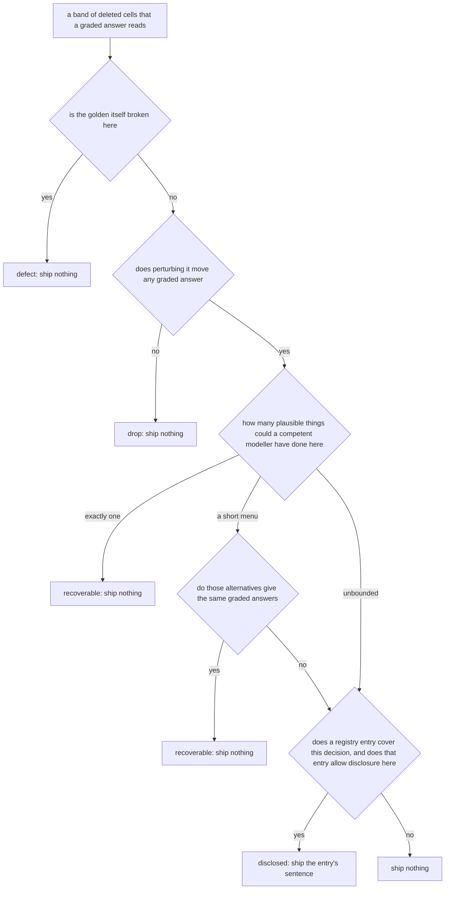

# Disclosure Taxonomy

The decision tree and the record labels. All content - which decisions exist, what values they
take, when they may ship, and how they read - lives in [REGISTRY.md](REGISTRY.md). Nothing is
defined in both places.

## The decision tree

The tree ends at Q4. There is no follow-up question.

### Q2 is answered from the workbook, not the registry

Q2 asks what a competent modeller looking at the golden and the delivered file could plausibly
have done: one obvious answer, a small set of candidates, or an open space.

It has to stay independent of the registry. If Q2 were a registry lookup, coverage would
already be settled by the time control reached Q4 - always true on the short-menu path, always
false on the unbounded path - and Q4's first half would never be a live question.

### Q4 has one no-exit

Q4 asks two things at once, so a `no` can mean "nothing covers this" or "something covers it
and refused". Both produce identical output: nothing ships, and `instruction.md` is
byte-identical either way. The tree says that once.

The distinction lives on the record, not in the graph. A record carries `entry`, so "was this
covered" is `entry is null`, and the backlog is a query over records rather than a terminal.

Terminals state the outcome and nothing else. A terminal that names a downstream queue will
eventually be wrong for some path that reaches it.

## Record labels

The tree has six terminals but only two outcomes: `SHIP`, and everything else, which ships
nothing. These labels are written on records for reporting and triage.

- `defect` - the golden is internally inconsistent here. Ships nothing.
- `drop` - cannot move a graded answer. Dead branch, clamp that never binds, or unused.
- `recoverable` - written two ways: only one plausible answer, or alternatives that all land in
  the same place within tolerance.
- `disclosed` - the only label on a shipped record.
- `suppressed` - covered by an entry whose `Ship when` declined. The record keeps its `entry`.
  Generates no work.
- `unclassified` - no entry covered it. The record has no `entry`, and that is the backlog
  query. Absorbs what an earlier taxonomy called `supplied`.
- `convention` and `method` - metadata recording which registry section an entry came from. A
  convention ships a value, a method ships a rule sentence. Both are `disclosed`.

`supplied` no longer exists. The tree decides disclosure only, so it has no outcome that
changes a task.

## Citation

Every record carries `entry`, the registry id that authorised it. A record without one cannot
ship. To add a new kind of hint, add a registry entry first, then implement its detector.
